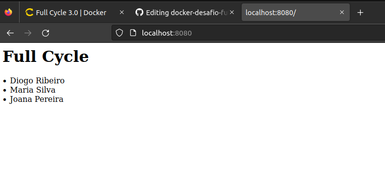

# Docker-desafio-fullcycle-01
Segundo desafio do módulo Docker do curso FullCycle 3.0

# Desafio
- Subir um serviço de proxy reverso nginx através da porta 8080.
- Subir um banco de dados mysql para armazenamento de dados.
- Subir uma aplicação em node js.

# Work FLow
- Todos os serviços devem subir quando comando `docker-compose up -d` for executado.
- Ao executar a aplicação node, alguns dados serão cadastrados no banco de dados.
- Ao acessar o endereço `http://localhost:8080` o app deve retornar o texto Full Cycle bem como a lista dos nomes que foram cadastrados no banco de dados.

# Exemplo
